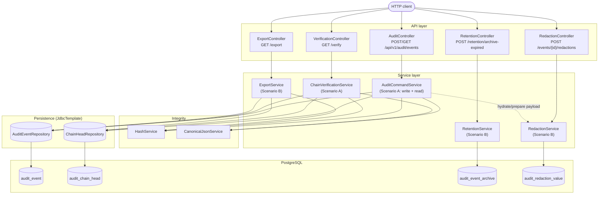

# Architecture

## Overview

The system is a single Spring Boot service backed by PostgreSQL. Scenario A implements the core
append-only, hash-chained audit log with filtered/paginated queries and full-chain verification.
Scenario B extends it with soft-archival retention, structured field-level redaction, and signed
bulk export — without weakening the Scenario A integrity guarantees.

The design stays deliberately small: one flat global chain, one Postgres instance, explicit SQL
via `JdbcTemplate` rather than an ORM, and no framework-level security layer yet (see
[Threat Model](threat-model.md) for what that leaves open).

## Component diagram

Scenario B services (`RetentionService`, `RedactionService`, `ExportService`) are additive: they
sit alongside `AuditCommandService` and read/write their own tables (`audit_event_archive`,
`audit_redaction_value`). None of them ever `UPDATE` or `DELETE` a row in `audit_event` — that
table stays exactly as Scenario A defined it, append-only and immutable, which is what lets
`ChainVerificationService` keep working unmodified after Scenario B was added.

## Persistence

PostgreSQL is the system of record; Flyway manages schema changes (`V1` = Scenario A tables,
`V2` = Scenario B additions); Spring JDBC (`JdbcTemplate`) is used directly for SQL and
transaction handling — no ORM.

## Integrity model

Every `audit_event` row carries `contentHash`, `previousHash`, and `chainHash`. The service uses
one global chain; the chain head is stored separately (`audit_chain_head`) and row-locked
(`SELECT ... FOR UPDATE`) during writes so concurrent writers serialize instead of forking the
chain. See [ADR-001](decisions/ADR-001-global-hash-chain.md) for why one global chain was chosen
over per-resource chains, and [ADR-002](decisions/ADR-002-server-timestamps.md) for why
`eventTimestamp` is server-assigned rather than caller-supplied.

## Design decisions and tradeoffs

| Decision | Why | Tradeoff | Detail |
|---|---|---|---|
| One global hash chain, not sharded per actor/resource | Simplest model that gives a single, total-ordered, fully verifiable log | All writes serialize on one lock; no write parallelism | [ADR-001](decisions/ADR-001-global-hash-chain.md) |
| Server-assigned `eventTimestamp`, not caller-supplied | Timestamps are part of the hashed content — a caller-controlled value would let a client backdate/reorder events without detection | Caller can't assert "when it actually happened" separately from "when the server saw it" | [ADR-002](decisions/ADR-002-server-timestamps.md) |
| Soft archival, never delete/update `audit_event` | Deleting rows would make full-chain verification impossible without special-casing gaps | Storage is never reclaimed; a real cold-storage design would need signed boundary checkpoints | [Scenario B: Retention](scenario-b.md#retention) |
| Redaction via commitment + separate encrypted-value table | Lets the immutable payload keep a stable, hashable placeholder while the real secret lives (and can be destroyed) outside the hash chain entirely | The configured key can never rotate without breaking already-issued commitments (they're baked into `content_hash` forever) | [Scenario B: Structured redaction](scenario-b.md#structured-redaction) |
| Export includes a signed chain anchor (genesis hash + current chain head), not a full inclusion proof | Filtered exports aren't chain-contiguous; a recipient needs *some* anchor back to the real chain, but a full Merkle-style inclusion proof is out of scope for this prototype | Recipients can verify each record's own hashes and verify truly-adjacent records against each other, but can't independently prove a non-adjacent record's position without a full chain read | [Scenario B: Bulk export](scenario-b.md#bulk-export) |
| No authentication/authorization layer | Kept out of scope to focus on the integrity/tamper-evidence design itself | Every endpoint — including irreversible redaction and bulk export — is currently open to any caller who can reach the service | [Threat Model](threat-model.md) |

## Deployment

The service runs locally via Docker Compose (PostgreSQL) and `./mvnw spring-boot:run` (see the
[README](../README.md#running-locally)). Production concerns — horizontal scaling, external key
management/rotation, external integrity anchoring (e.g., publishing periodic chain-head
checkpoints), and authentication — are called out above and in the threat model, but not
implemented in this prototype.
